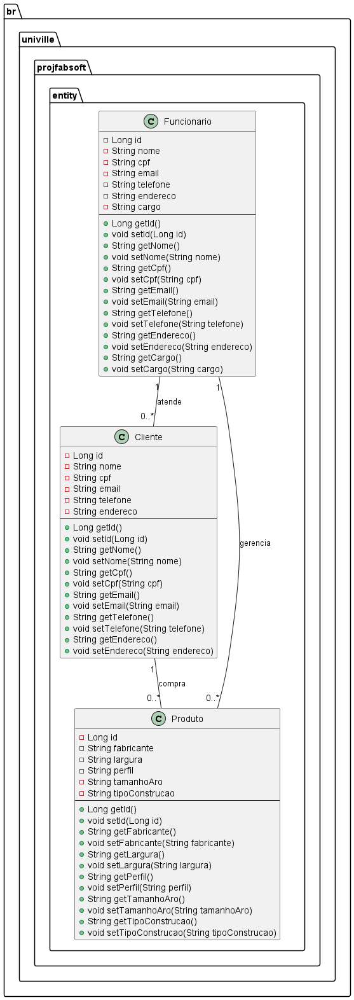

# Fabrica de Software 2025/1

## Nome da Equipe
- João Eduardo
- Vinicius Aron

## Proposta de projetos

- Nome do sistema: Sistema de gerenciamento de estoque para empresa de venda de pneu
    - Funcionalidade 1 Cadastrar dados do cliente
    - Funcionalidade 2 Cadastrar produto
    - Funcionalidade 3 Buscar por fabricante
    - Funcionalidade 4 Buscar por medida de largura do pneu
    - Funcionalidade 5 Buscar por medida de perfil do pneu
    - Funcionalidade 6 Buscar por tamanho do aro
    - Funcionalidade 7 Buscar por tipo de construção

## Livro Eng Software Moderna
[Eng. Soft Moderna - Requisitos](https://engsoftmoderna.info/cap3.html)

### Histórias de Usuário

- Histórias de Usuário - Perspectiva do Gerente

    - Como um Gerente, eu gostaria que meus atendentes pudessem cadastrar os dados dos clientes, incluindo nome, CPF, e-mail, telefone e endereço, garantindo que todas as informações estejam organizadas no sistema para agilizar o atendimento e facilitar futuras consultas.

    - Como um Gerente, eu gostaria que meus atendentes tivessem acesso rápido e seguro aos dados dos clientes cadastrados, como nome, CPF, e-mail, telefone e endereço, para melhorar a experiência do cliente, evitar erros e otimizar o tempo de atendimento.

    - Como um Gerente de Estoque, eu gostaria que minha equipe pudesse cadastrar novos produtos no sistema, incluindo fabricante, tamanho do aro, largura do pneu, perfil do pneu e tipo de construção, para garantir um controle preciso do estoque e facilitar a busca por itens específicos.

    - Como um Gerente de Estoque, eu gostaria que minha equipe pudesse buscar produtos por fabricante, largura do pneu, perfil do pneu, tamanho do aro e tipo de construção, para facilitar o gerenciamento do estoque, otimizar o reabastecimento e agilizar o atendimento aos clientes.

    - Como um Gerente de Estoque, eu gostaria que o sistema permitisse a atualização e correção das informações dos produtos já cadastrados, garantindo que todos os dados estejam corretos e atualizados para evitar confusões e garantir que os vendedores possam fornecer informações precisas aos clientes.

    - Como um Gerente, eu gostaria de cadastrar e gerenciar os funcionários da empresa, incluindo nome, CPF, e-mail, telefone, endereço e cargo, garantindo um controle eficiente da equipe e suas responsabilidades dentro da organização.

    - Como um Gerente, eu gostaria que meus funcionários tivessem um sistema confiável para buscar produtos no estoque com filtros por fabricante, medidas e tipo de construção, garantindo que os clientes recebam informações rápidas e precisas sobre a disponibilidade dos produtos.

    - Como um Gerente de Estoque, eu gostaria que minha equipe pudesse consultar rapidamente a disponibilidade de produtos por diferentes características, como medidas e tipo de construção, para melhorar o atendimento e evitar perda de vendas por falta de informação.

    - Como um Gerente, eu gostaria de acessar relatórios de cadastros de clientes e produtos, para monitorar a eficiência dos atendentes e da equipe de estoque, garantindo que as informações estejam sempre organizadas e atualizadas.

    - Como um Gerente, eu gostaria que o sistema possibilitasse a busca rápida de funcionários cadastrados, facilitando a consulta de dados para contato e a organização da equipe de trabalho.


- Histórias de Usuário - Perspectiva do Cliente

    - Como um Cliente, eu gostaria que meus dados pessoais, como nome, CPF, e-mail, telefone e endereço, fossem cadastrados corretamente no sistema, para que o atendimento seja mais rápido e eficiente sempre que eu precisar de suporte ou realizar uma compra.

    - Como um Cliente, eu gostaria de poder atualizar meus dados cadastrais sempre que necessário, garantindo que minhas informações estejam corretas e evitando problemas no contato com a loja ou na entrega dos produtos.

    - Como um Cliente, eu gostaria que os produtos estivessem cadastrados no sistema com todas as informações detalhadas, como fabricante, tamanho do aro, largura do pneu, perfil do pneu e tipo de construção, para que eu possa escolher o modelo adequado ao meu veículo com mais segurança.

    - Como um Cliente, eu gostaria de buscar produtos no sistema por fabricante, para encontrar facilmente modelos de marcas que eu confio e prefiro utilizar.

    - Como um Cliente, eu gostaria de pesquisar pneus disponíveis filtrando por largura, perfil e tamanho do aro, garantindo que eu compre um produto compatível com o meu veículo sem precisar de ajuda externa.

    - Como um Cliente, eu gostaria que o sistema me permitisse visualizar o tipo de construção dos pneus disponíveis, para que eu possa escolher o mais adequado às minhas necessidades e ao tipo de estrada que costumo utilizar.

    - Como um Cliente, eu gostaria que os atendentes tivessem acesso rápido às informações dos produtos, garantindo que eu receba um atendimento mais eficiente e preciso na hora de tirar dúvidas sobre disponibilidade ou compatibilidade.

    - Como um Cliente, eu gostaria que o sistema me mostrasse apenas produtos disponíveis em estoque quando eu realizar uma busca, evitando frustrações ao selecionar um item que não está mais à venda.

    - Como um Cliente, eu gostaria de ter um histórico de minhas compras e produtos adquiridos, para facilitar futuras reposições e garantir que eu compre sempre o modelo correto para meu veículo.

    - Como um Cliente, eu gostaria que o sistema permitisse uma busca eficiente pelos produtos utilizando diferentes filtros, como fabricante, medidas e tipo de construção, para encontrar o modelo ideal sem precisar percorrer toda a listagem de itens disponíveis.

## Comandos do Git

### Instalação
[Git Bash](https://git-scm.com/downloads)

### Configuração inicial

```
git config --global user.name "NOME DO USUARIO NO GITHUB"
git config --global user.email "EMAIL DA CONTA DO GITHUB"
```
### Tipos de mensagens do commit

- feat: (new feature for the user, not a new feature for build script)
- fix: (bug fix for the user, not a fix to a build script)
- docs: (changes to the documentation)
- style: (formatting, missing semi colons, etc; no production code change)
- refactor: (refactoring production code, eg. renaming a variable)
- test: (adding missing tests, refactoring tests; no production code change)
- chore: (updating grunt tasks etc; no production code change)

### Commit e Push

```
git add .
git commit -m "tipo: o que foi feito"
git push -u origin main
```

### Criar um branch a partir da branch atual
```
git checkout -b branch-seunome
```

### Revisão de Java

[Download JDK](https://adoptium.net/)

- JRE - Java Runtime Environment (java.exe)
  - Máquina virtual do Java - interpreta o Bytecode(.class) do Java para linguagem de máquina
- JDK - Java Development Kit (javac.exe)
  - Compilar o código Java em bytecode (.class)


### Criação de projeto no VSCode com Maven
1) teclar F1
2) digitar Java e escolher a opção create ne java project
3) project type: MAVEN
4) Archetype: no Archetype
5) pacote digitar domínio ao contrário ex: br.univille
6) nome do projeto em minúsculo
7) usar a pasta sugerida pelo VSCode

### Site sobre Design Patterns
https://refactoring.guru/design-patterns

### Diagrama de classes


### Criar as entidades
```bash
@workspace #sym:## Histórias de Usuário por favor, encontre as entidades
```

### Gerar as classes Java das entidades
```bash
@workspace por favor, gere no pacote br.univille.projfabsoft.entity as classes java para representar as entidades
```

### Gerar o diagrama de entidades UML
```bash
@workspace por favor, gere um diagrama uml utilizando o padrão plantuml para as classes no pacote br.univille.projfabsoft.entity
```

